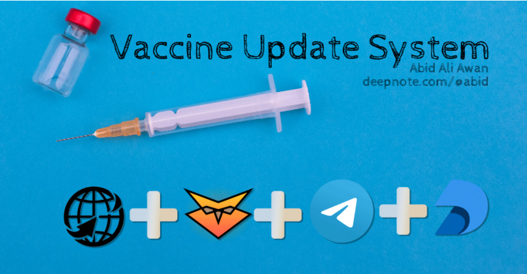

# Project Showcase

In this section we will be displaying some of the projects made with sqllex. 

## Vaccine Update System by @kingabzpro

Using Deepnote schedule features, pandas, telegram bot, and sqllex for updating database **[Abid](https://github.com/kingabzpro)** have created an interactive dashboard that will run every day and add values vaccine data of both world and Pakistan. This will be also showing the progress of vaccination in different parts of the world with interactive visual graphs. 

## Sqllex for Data Science Using `Pandas` by @kingabpro

In this article, **[Abid](https://github.com/kingabzpro)** has experimented with pandas integration with sqllex. This is a very interesting and beginner-friendly article, which plays around with the existing database, creating a new database, adding a database using pandas, and then using all SQL queries to get the perfect result for Data analysis. 

### [Back to home](README.md)